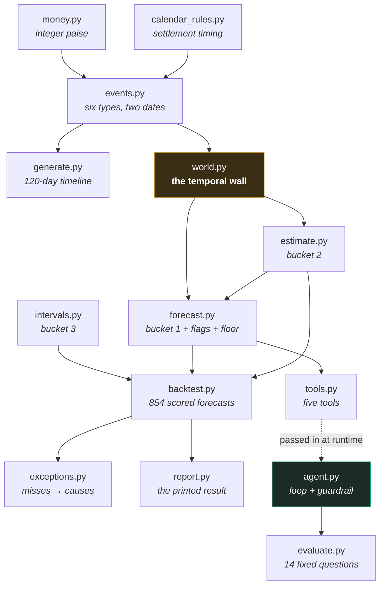
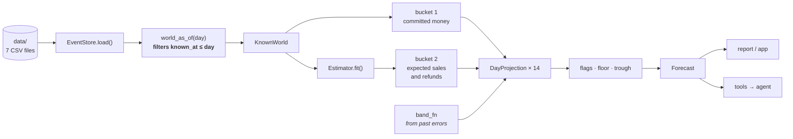
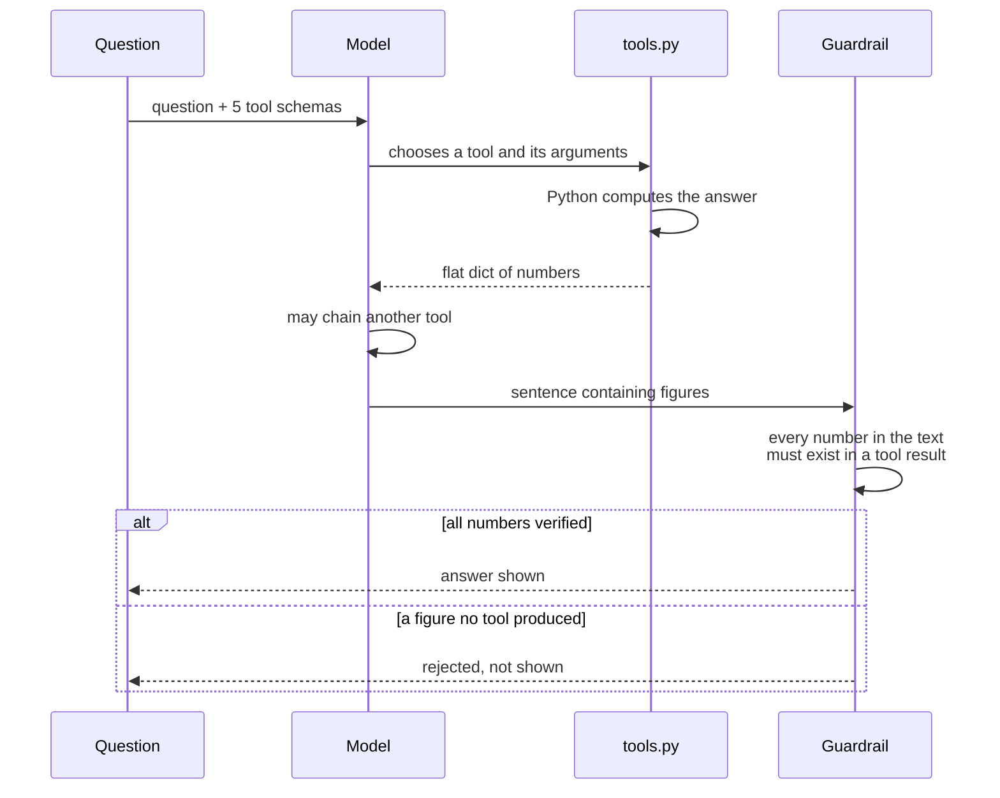

# Architecture

How this was reasoned about before it was built, and why the pieces sit where they do.

---

## The question everything is shaped around

> **Will there be enough in the bank on Friday?**

Not *"how much did we sell?"* — a business can be profitable and still miss payroll,
because profit and cash are different things. Every structural decision below follows
from taking that one question literally.

## Why it is hard

When a customer pays by card, **the money does not arrive.**

- It sits with the payment gateway for two working days, and lands **net of fees**
- UPI arrives a day sooner
- **Refunds come off a later payout than the sale they reverse**
- Chargebacks appear weeks after the fact
- Nothing settles on a weekend or a bank holiday, and a 6pm cutoff pushes a late sale
  into the next day's cycle

So a merchant who sold ₹95,000 this week does not have ₹95,000. They have some of it,
arriving in pieces, on days that depend on when each sale was captured and how it was
paid for. **The timing is the problem, not the total.**

---

## Principle 1 — every event carries two dates

This is the decision the whole system rests on.

| | |
|---|---|
| `known_at` | when the merchant could first *know* about it |
| `cash_at` | when the money actually *moves* |

A chargeback raised on the 12th and debited on the 15th is **certain from the 12th**.
No money has moved, but nothing about it is a guess any more.

Without this split, "what do I know today" and "what happens today" collapse into one
field, and there is no way to express the most valuable category in the whole
system: *money that is committed but has not landed.*

## Principle 2 — the wall is structural, not a promise

The data generator knows all 120 days. **The forecaster must not.**

The temptation is to write `# careful: don't look at future events` and rely on
discipline. That fails silently the first time someone adds a feature.

Instead, the forecaster's *only* access to data is `world_as_of(day)`, which filters
every record on `known_at <= day` and hands back a `KnownWorld`. The forecaster never
receives a file path, a store, or a date range. **It cannot see the future even by
accident, because it holds no reference to anything that contains it.**

Verified by a test that deletes every event after the vantage day and asserts the
forecast is byte-identical.

---

## The three buckets

The output separates what it knows from what it is guessing, because a single number
hides which is which.

| Bucket | Covers | Method |
|---|---|---|
| **1 · Certain** | Money captured and in transit, refunds and chargebacks already raised, committed outflows | Arithmetic on known facts. No prediction at all. |
| **2 · Estimated** | Future sales, future refunds | Weekday averages, a refund rate, a lag distribution — measured from history |
| **3 · Honest** | Everything left over | Not predicted. Reported as a range, with a calibration check on whether the range tells the truth. |

The share that is *certain* falls from 100% tomorrow to 8% at fourteen days, and the
error is allowed to rise as it falls. **That relationship is the result** — not any
single accuracy figure.

## Build order — deliberately not 1 → 2 → 3

```
1. Generator          events unfolding day by day
2. Bucket 1           deterministic walk-forward
3. Backtest harness   measure Bucket 1 alone        ← must precede 4
4. Bucket 2           measured as an improvement over 3
5. Bucket 3           intervals derived from 3's residuals
6. Agent              sits on top of finished machinery
```

Step 3 has to come before step 4 or there is nothing to compare against, and step 5
literally consumes step 3's output.

What this buys is **a number at every stage** rather than one number at the end:

> Deterministic only → add the statistical layer → add calibrated bands,
> each measured against the last.

The agent goes last on purpose. Building it early means debugging the model and the
forecaster at the same time, and never knowing which one is wrong.

---

## The module map



Two things in that graph are deliberate:

**`forecast.py` does not import `intervals.py`.** The uncertainty band arrives as a
function argument. The forecaster does not know how its bands are made, so bands can
be swapped, disabled, or replayed from an earlier vantage point without touching it.

**`agent.py` imports nothing from this project at all.** Tools and schemas are passed
in as arguments. The agent has no route to the data even if the model asked for one —
the only thing it can reach is what a tool already returned.

---

## One forecast, end to end



The forecaster receives `KnownWorld` and a band function. It never sees `data/`.

---

## How accuracy is established

You cannot wait a month to find out whether a forecast was good, so the dataset is 120
days where every event is already known, and the forecaster is tested by **standing in
the past**:

```
stand on day 46 → forecast days 47–60 → compare each to what happened
stand on day 47 → forecast days 48–61 → compare
...
stand on day 106

61 vantage points × 14 horizons = 854 scored forecasts
```

Three rules make the number mean something:

**Never pooled across horizons.** Tomorrow is nearly free and a fortnight is mostly
estimate. One averaged figure would describe neither.

**Baselines fixed before measuring.** "The average of the last 14 balances" was chosen
in advance as the strongest of five trivial rules. A baseline picked after seeing the
results is a baseline picked for being beatable.

**Bands are rolling, never pooled.** An interval for day *n* is built only from errors
at vantage points *before* day *n*. The ordering *is* the honesty guarantee, which is
why `RollingIntervals` is stateful and order-dependent rather than a pure function.

Then `exceptions.py` takes every miss above the noise floor and attributes it to a
cause, marking each fixable or not — so the failure list is a diagnosis rather than
an apology.

---

## The agent layer



**The model decides what to look at. Python does every calculation.**

`can_i_afford` exists precisely for this reason: *"is ₹2,00,000 more than Thursday's
balance"* is a comparison, and a comparison is arithmetic — so it happens in a tool,
not in the model's head. `get_tightest_day` returns `falls_below_floor` as a boolean
for the same reason.

Tools return **flat dicts of primitives**, never prose. An earlier version returned a
human-readable summary string and a real model read three *incoming* payments as
outgoing, and read a "+24 smaller" tail as a ₹24 adjustment. Both numbers were real,
so the guardrail passed it — it checks figures, not meaning. Prose is the model's
output, never its input.

---

## What each module owns

| Module | Owns | Deliberately does not |
|---|---|---|
| `money.py` | Integer paise, half-up rounding, per-transaction fee and GST | Know what a sale is |
| `calendar_rules.py` | Working days, holidays, cutoffs, T+1 / T+2 | Know about money |
| `events.py` | Six event types, `known_at` and `cash_at` on each | Know when anything happened |
| `generate.py` | The 120-day synthetic timeline | Exist at forecast time |
| `world.py` | **The wall.** `world_as_of`, named queries, balance audit | Forecast anything |
| `estimate.py` | Weekday baselines, refund rate and lag, growth correction | Touch certain money |
| `forecast.py` | Bucket 1, flags, the derived floor, the explained projection | Know how bands are made |
| `intervals.py` | Rolling empirical bands and their calibration | Know what it is bounding |
| `backtest.py` | The vantage-point loop, baselines, scoring | Contain any forecasting logic |
| `exceptions.py` | Attributing misses to causes, with remedies | Fix anything |
| `tools.py` | The five things the agent may look at | Format prose |
| `agent.py` | The loop, the Model seam, the guardrail | Import anything from this project |
| `evaluate.py` | 14 questions fixed in advance — 7 to answer, 7 to refuse | Be run against a live API in tests |

---

## Structural decisions

| Decision | Reason |
|---|---|
| **Integer paise, never a float** | The product is a claim that numbers tie exactly. `0.1 + 0.2 != 0.3` is a curiosity in most programs and a defect here. |
| **Half-up rounding** | `round(2.5)` gives 2 in Python. Defensible for statistics, wrong for an invoice. |
| **Fees applied per transaction, not per batch** | The two answers diverge, and per-transaction is what the gateway does — so it is what reaches the bank. |
| **Only four of six event types move cash** | Orders and promotions are knowledge-only: they change what you *expect*, not the balance. So the daily balance is one sum over `cash_delta`, with no branching on type. |
| **Settlements are derived, not stored** | A settlement is just the payments sharing a date. Storing them separately means two places holding the same money, and a chance to double-count. |
| **A derived floor, not a chosen one** | *"Why ₹1,00,000?"* has no good answer. *"Because that is what you owe on the 12th"* does. |
| **The model developed against a stub** | A fake model returning canned tool calls tests the whole loop with zero API calls — and is the only way to have tests for an agent, since tests that hit a live API are tests you stop running. |
| **Four runtime dependencies** | No pandas: one missing value silently promotes an int column to `float64`, which is exactly the bug class this repo claims to avoid. |

## Deliberately absent

- **No machine learning.** The forecast is averages, ratios and percentiles. With 120
  days of self-generated data a model would be untestable, and in finance a number
  that cannot be explained cannot be signed off.
- **No `Settlement` class.** See above — derived, not stored.
- **No multi-account allocation, no FX, no marketplace payouts.** One merchant, one
  bank account, one gateway.
- **No chargeback prediction.** Too rare for any dataset this size to estimate a rate
  from — unpredictable in principle, not merely unpredicted. Certain once raised,
  refused before.

---

*Failure log, with what each mistake cost to find: [`notes/design-log.md`](notes/design-log.md)*
